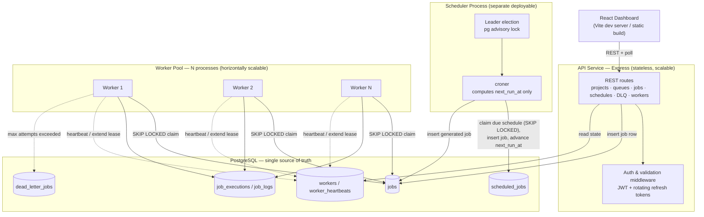

# Architecture

## Overview

A distributed job scheduling platform built on PostgreSQL as the single
stateful component — no Redis, no external message broker. All queueing,
locking, and scheduling state lives in Postgres, and job claiming is made
atomic across concurrent workers using `SELECT ... FOR UPDATE SKIP LOCKED`.

The system is split into four independently deployable pieces plus the
database.

## Component responsibilities

### API service (`packages/api`)

Stateless Express application; can be scaled to multiple instances behind a
load balancer. Owns all synchronous request/response work:

- Authentication (register, login, refresh-token rotation, logout) using JWT
  access tokens and DB-backed, revocable, rotating refresh tokens.
- CRUD for organizations, projects, queues, and retry policies.
- Job submission (immediate, delayed, and batch) and the job explorer
  (list with keyset pagination and filters, detail, execution history, logs).
- Recurring (cron) job definitions.
- Dead-letter-queue listing and retry.
- Worker fleet visibility.

The API never executes jobs itself — it only writes rows into `jobs` (or
`scheduled_jobs`) that workers and the scheduler later act on.

### Scheduler process (`packages/scheduler`)

A **separate** deployable, not a thread inside the API. It owns the
`scheduled_jobs` table. On each tick it:

1. Attempts to become leader via a Postgres session-level advisory lock
   (`pg_try_advisory_lock`). Running several scheduler instances for high
   availability is safe: only the one holding the lock does work, and if it
   crashes the lock is released automatically, so another instance takes over.
2. Selects due `scheduled_jobs` rows (`next_run_at <= now()` and enabled) with
   `FOR UPDATE SKIP LOCKED`.
3. Inserts a normal `jobs` row for each due schedule.
4. Advances `next_run_at` using the cron library, then commits.

Because the enqueue step itself uses row-level locking, even a brief
leader-election overlap cannot cause the same scheduled run to be enqueued
twice.

### Worker pool (`packages/worker`)

N independent processes, scaled horizontally. Each worker:

- Polls its queue(s) and claims a batch of jobs atomically (see below).
- Executes each job through a pluggable handler registry keyed by job `type`.
- Sends heartbeats and periodically extends the job's lease (`locked_until`)
  so long-running jobs aren't mistaken for crashed ones.
- On success, marks the job completed and records a `job_executions` row.
- On failure, applies the job's retry policy (fixed / linear / exponential
  backoff) or, once attempts are exhausted, moves the job to
  `dead_letter_jobs`.
- Supports graceful shutdown: it stops claiming new work and lets in-flight
  jobs finish before exiting.

A reaper reclaims jobs whose lease expired without a heartbeat — this is what
makes a worker crash non-fatal: no one needs to detect the crash, the lease
simply runs out and the job returns to the queue.

### PostgreSQL

The only stateful component. Holds both the "business" data (orgs, projects,
queues) and all the operational/queue state (jobs, executions, workers,
schedules, dead letters) in one place. This trades some raw throughput ceiling
for transactional consistency between job state and business data, one fewer
moving part to operate, and concurrency-safe dequeuing via `SKIP LOCKED`
without a separate broker.

### Web dashboard (`packages/web`)

React + Vite single-page app. Covers:

- Auth (login/register), project and queue management, standalone retry
  policy management.
- Job submission (immediate, delayed, batch) and a job explorer with a
  visual lifecycle pipeline (highlighting the job's current stage across
  Queued → Scheduled → Claimed → Running → Completed, with the retry and
  dead-letter branches shown) and live countdown timers - one counting down
  to `runAt` for queued/scheduled jobs, another counting down to the
  worker's lease expiry (`lockedUntil`) for running jobs, making the
  heartbeat/reclaim mechanism visible rather than invisible plumbing.
- Recurring job creation via either a "Simple" mode (a plain "every N
  minutes/hours/days" input, converted client-side to the equivalent cron
  expression) or an "Advanced" mode (raw cron expression) - the backend only
  ever sees a cron string either way.
- Dead-letter queue view with one-click retry.
- Worker fleet monitoring, including per-worker heartbeat history.
- A dashboard home page aggregating org-wide job status counts, worker
  online/offline counts, a 24-hour throughput chart, and recent dead-letter
  entries - plus the same statistics scoped to an individual queue.

The Vite dev server proxies `/api` to the API service on port 3000.

## How the cron library and the Postgres queue divide responsibility

This is the key design point for recurring jobs:

- The cron library (`croner`) is used **only** as a pure function: given a cron
  expression and a reference time, it returns the next time the job should run.
  It never triggers or executes anything.
- The scheduler writes that computed time into `scheduled_jobs.next_run_at`.
- When a tick finds a schedule whose `next_run_at` has passed, it inserts an
  ordinary row into `jobs` and advances `next_run_at` to the following
  occurrence.
- From that point the generated job is completely ordinary — a worker claims
  and runs it through the exact same `SKIP LOCKED` path as a manually submitted
  job.

The benefit is restart-safety: because `next_run_at` lives in the database
rather than in an in-process timer, a scheduler crash or restart never causes a
missed or duplicated firing.
