# Entity-Relationship Diagram

Derived from `packages/db/prisma/schema.prisma`. All 13 entities required by the
assignment are present. Column lists below show primary keys (PK), foreign keys
(FK), and the columns most relevant to understanding each table's role — not
every column (see the schema for the exhaustive definition).

```mermaid
erDiagram
    ORGANIZATIONS ||--o{ USERS : "has"
    ORGANIZATIONS ||--o{ PROJECTS : "has"
    USERS ||--o{ REFRESH_TOKENS : "has"
    USERS ||--o{ PROJECTS : "created"
    PROJECTS ||--o{ QUEUES : "has"
    PROJECTS ||--o{ RETRY_POLICIES : "defines"
    QUEUES }o--o| RETRY_POLICIES : "default policy"
    QUEUES ||--o{ JOBS : "contains"
    QUEUES ||--o{ SCHEDULED_JOBS : "defines"
    RETRY_POLICIES }o--o{ JOBS : "snapshotted onto"
    JOBS ||--o{ JOB_EXECUTIONS : "has"
    JOB_EXECUTIONS ||--o{ JOB_LOGS : "has"
    JOB_EXECUTIONS }o--o| WORKERS : "run by"
    WORKERS ||--o{ WORKER_HEARTBEATS : "sends"
    WORKERS }o--o{ JOBS : "claims"
    SCHEDULED_JOBS ||--o{ JOBS : "generates"
    JOBS |o--o| DEAD_LETTER_JOBS : "moved to"

    ORGANIZATIONS {
        uuid id PK
        text name
        timestamptz created_at
    }
    USERS {
        uuid id PK
        uuid org_id FK
        text email UK
        text password_hash
        text name
        enum role
        timestamptz created_at
        timestamptz updated_at
    }
    REFRESH_TOKENS {
        uuid id PK
        uuid user_id FK
        text token_hash UK
        timestamptz expires_at
        timestamptz revoked_at
    }
    PROJECTS {
        uuid id PK
        uuid org_id FK
        text name
        uuid created_by FK
        timestamptz created_at
        timestamptz deleted_at
    }
    RETRY_POLICIES {
        uuid id PK
        uuid project_id FK
        text name
        enum strategy
        int base_delay_ms
        int max_delay_ms
        int max_attempts
        float multiplier
    }
    QUEUES {
        uuid id PK
        uuid project_id FK
        text name
        int priority
        int max_concurrency
        bool is_paused
        uuid default_retry_policy_id FK
    }
    JOBS {
        uuid id PK
        uuid queue_id FK
        text type
        jsonb payload
        enum status
        int priority
        timestamptz run_at
        int attempts
        int max_attempts
        uuid retry_policy_id FK
        uuid claimed_by FK
        timestamptz locked_until
        text idempotency_key
        uuid scheduled_job_id FK
    }
    JOB_EXECUTIONS {
        uuid id PK
        uuid job_id FK
        uuid worker_id FK
        int attempt_number
        enum status
        timestamptz started_at
        timestamptz finished_at
        text error_message
        jsonb result
    }
    JOB_LOGS {
        uuid id PK
        uuid job_execution_id FK
        enum level
        text message
        timestamptz logged_at
    }
    WORKERS {
        uuid id PK
        text hostname
        int pid
        enum status
        timestamptz started_at
        timestamptz last_seen_at
    }
    WORKER_HEARTBEATS {
        uuid id PK
        uuid worker_id FK
        timestamptz heartbeat_at
        uuid current_job_id
    }
    SCHEDULED_JOBS {
        uuid id PK
        uuid queue_id FK
        text name
        text cron_expression
        text timezone
        text job_type
        jsonb payload_template
        bool is_enabled
        timestamptz next_run_at
        timestamptz last_run_at
    }
    DEAD_LETTER_JOBS {
        uuid id PK
        uuid original_job_id FK
        uuid queue_id FK
        text job_type
        jsonb payload
        text failure_reason
        int attempts
        timestamptz moved_at
    }
```

## Keys, indexes, and cascade behavior

### Primary keys

Every table uses a UUID primary key, generated database-side by
`gen_random_uuid()`.

### Notable indexes

- `jobs (queue_id, priority DESC, run_at)` — **partial**, `WHERE status IN
  ('QUEUED','SCHEDULED')`. This is the index the atomic claim query hits; being
  partial keeps it small relative to the full table even at high volume.
- `jobs (claimed_by, locked_until)` — **partial**, `WHERE status IN
  ('CLAIMED','RUNNING')`. Used by the lease reaper to find expired claims.
- `jobs (queue_id, idempotency_key)` — **unique**, so a client-supplied
  idempotency key can't create duplicate jobs in a queue.
- `scheduled_jobs (next_run_at, is_enabled)` — for the scheduler's due-jobs poll.
- `queues (project_id, name)`, `projects (org_id, name)`,
  `retry_policies (project_id, name)`, `scheduled_jobs (queue_id, name)` —
  **unique**, enforcing per-parent name uniqueness.
- Foreign-key columns on the history tables (`job_executions.job_id`,
  `job_logs.job_execution_id`, `worker_heartbeats.worker_id`) are indexed for
  fast lookups.

### Cascade behavior

| Relationship | On delete | Rationale |
|---|---|---|
| `users.org_id → organizations` | RESTRICT | Never silently destroy users when an org is removed. |
| `projects.org_id → organizations` | RESTRICT (+ soft delete on projects) | Org deletion should be explicit and auditable. |
| `queues.project_id → projects` | CASCADE | Queues have no independent existence. |
| `jobs.queue_id → queues` | CASCADE | Jobs belong entirely to their queue. |
| `job_executions.job_id → jobs` | CASCADE | Pure history, meaningless without the job. |
| `job_logs.job_execution_id → job_executions` | CASCADE | Same. |
| `worker_heartbeats.worker_id → workers` | CASCADE | Heartbeat history is worthless without the worker. |
| `jobs.claimed_by → workers` | SET NULL | A worker can be deregistered without losing job history. |
| `dead_letter_jobs.original_job_id → jobs` | SET NULL | DLQ rows must survive job archival/purge — the DLQ keeps its own payload snapshot. |

### Normalization notes

- `job_executions` and `job_logs` are split out from `jobs` to avoid repeating
  groups: one job has many attempts, each attempt many log lines (3NF).
- `retry_policies` is its own reusable table, **but** `jobs.max_attempts` and
  `jobs.retry_policy_id` are snapshotted onto the job at creation time — a
  deliberate denormalization so editing a policy never changes the behavior of
  jobs already in flight.
- `dead_letter_jobs` is a separate table rather than a `jobs.status` flag, so
  the hot `jobs` table (and its indexes) stays lean, and DLQ entries can carry
  their own copy of the payload and failure reason.
